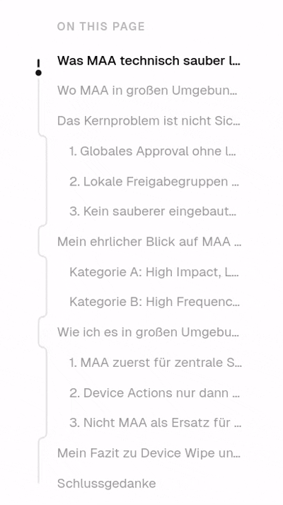

# `toc-nav` — atlas-kit



A scroll-tracked Table of Contents for Next.js / React with:

- **Animated SVG track line** — dim background + bright foreground clipped to the current viewport slice
- **Floating dot** — binary-searches the path to stay on the track as you scroll
- **Rounded indent steps** — smooth bezier corners when the path steps between h2 and h3
- **Headless core** — `useTocNavigation` hook with zero markup so you can build any UI on top
- **No hard dependencies** — no `lucide-react`, no `clsx`/`cn` import required

---

## Installation

Copy the `toc-nav/` folder into your project (shadcn style — you own the code).

**Peer deps:**

```json
{
  "react": ">=18",
  "react-dom": ">=18"
}
```

Tailwind CSS v4 (or v3) is assumed for the UI wrapper. If you use the headless hook only, no CSS framework is needed.

---

## Quick start

```tsx
import { TocNav } from '@/components/toc-nav'
import type { TocItem } from '@/components/toc-nav'

const headings: TocItem[] = [
  { id: 'intro',    text: 'Introduction',   level: 2 },
  { id: 'setup',    text: 'Setup',          level: 2 },
  { id: 'config',   text: 'Configuration',  level: 3 },
  { id: 'deploy',   text: 'Deploy',         level: 2 },
]

export default function BlogLayout({ children }: { children: React.ReactNode }) {
  return (
    <div>
      <TocNav items={headings} />
      <article>{children}</article>
    </div>
  )
}
```

`TocNav` renders a **collapsible mobile bar** (`xl:hidden`) and a **fixed desktop sidebar** (`hidden xl:flex`). Both disappear automatically when fewer than 2 headings are passed.

---

## Props

### `TocNav`

| Prop           | Type        | Default          | Description                                                   |
| -------------- | ----------- | ---------------- | ------------------------------------------------------------- |
| `items`        | `TocItem[]` | —                | Ordered list of headings. Each item needs `id`, `text`, `level`. |
| `headerOffset` | `number`    | `88`             | Pixels reserved for a sticky header (scroll tracking + smooth-scroll offset). |
| `label`        | `string`    | `"On this page"` | Section label shown in the mobile toggle and nav `aria-label`. |
| `icon`         | `ReactNode` | chevron SVG      | Custom icon for the mobile toggle. Wrap in a `<span>` with a CSS `rotate` transition if you want the open/closed animation. |

### `TocItem`

```ts
interface TocItem {
  id: string       // matches the `id` attribute of the heading element in the DOM
  text: string     // display text
  level: 2 | 3    // only h2 and h3 are supported
}
```

---

## Headless usage

Use `useTocNavigation` when you want full control over the markup:

```tsx
'use client'

import { useTocNavigation } from '@/components/toc-nav'
import type { TocItem } from '@/components/toc-nav'

export function MyToc({ items }: { items: TocItem[] }) {
  const { visibleIds, svgPath, svgH, ready, listRef, itemRefs, clipRectRef, fgPathRef, dotGroupRef, scrollTo } =
    useTocNavigation(items, { headerOffset: 64 })

  return (
    <nav style={{ opacity: ready ? 1 : 0 }}>
      {/* your custom SVG + list markup here */}
    </nav>
  )
}
```

### Hook return values

| Key           | Type                                  | Description                                                    |
| ------------- | ------------------------------------- | -------------------------------------------------------------- |
| `visibleIds`  | `string[]`                            | IDs of headings visible in (or nearest to) the current viewport. |
| `svgPath`     | `string`                              | SVG `d` attribute for the track. Empty string until after first layout. |
| `svgH`        | `number`                              | Height of the SVG canvas. Equals the list's `scrollHeight`.   |
| `ready`       | `boolean`                             | Becomes `true` after the first scroll computation.            |
| `listRef`     | `RefObject<HTMLUListElement>`         | Attach to the `<ul>`.                                         |
| `itemRefs`    | `MutableRefObject<Map<string, HTMLLIElement>>` | Attach each `<li>` by ID.                         |
| `clipRectRef` | `RefObject<SVGRectElement>`           | Attach to the clip `<rect>`. Updated every rAF frame.         |
| `fgPathRef`   | `RefObject<SVGPathElement>`           | Attach to the foreground `<path>`.                            |
| `dotGroupRef` | `RefObject<SVGGElement>`              | Attach to the dot `<g>`. Transform updated every rAF frame.   |
| `scrollTo`    | `(id: string) => void`                | Smooth-scrolls to the heading anchor.                         |

---

## Pure utilities

```ts
import { buildPath, LINE_X, docToSvgY } from '@/components/toc-nav'
```

| Export       | Signature                                                       | Description                                         |
| ------------ | --------------------------------------------------------------- | --------------------------------------------------- |
| `buildPath`  | `(pts: {x,y}[]) => string`                                      | Generates the SVG `d` string with rounded corners.  |
| `LINE_X`     | `Record<2 \| 3, number>`                                        | `{ 2: 6, 3: 14 }` — X position of each indent level. |
| `docToSvgY`  | `(docY, articleTops, tocYs) => number`                          | Piecewise linear mapping from document Y to SVG Y.  |

---

## CSS variables

The SVG track uses standard shadcn/Tailwind CSS variables. No extra config needed if you already use shadcn:

| Variable              | Used for                    |
| --------------------- | --------------------------- |
| `--color-border`      | Dim background track        |
| `--color-primary`     | Bright active track and dot |
| `--color-background`  | Dot halo (punches through)  |

---

## Extracting headings from MDX

`TocItem` is framework-agnostic. Here is a minimal extractor using `github-slugger` (same algorithm as `rehype-slug`):

```ts
import GithubSlugger from 'github-slugger'
import type { TocItem } from '@/components/toc-nav'

export function extractHeadings(mdxSource: string): TocItem[] {
  const slugger = new GithubSlugger()
  const matches = [...mdxSource.matchAll(/^(#{2,3})\s+(.+)$/gm)]
  return matches.map((m) => ({
    level: m[1].length as 2 | 3,
    text: m[2].trim().replace(/`([^`]+)`/g, '$1'),
    id: slugger.slug(m[2].trim()),
  }))
}
```